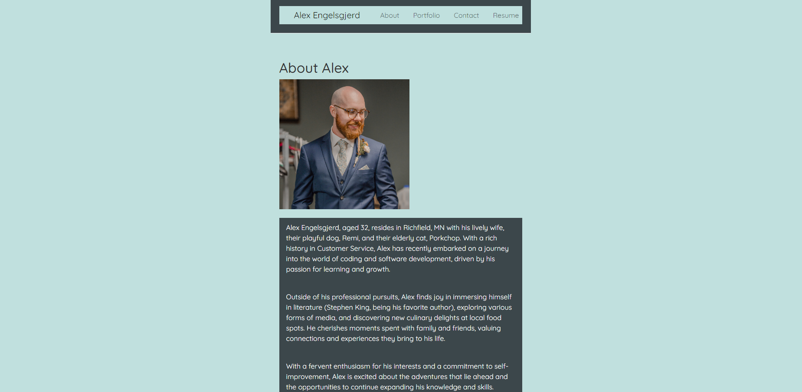

# Portfolio Website for Alex Engelsgjerd

## Description

This is a portfolio website for Alex Engelsgjerd. He is a student in Coding Bootcamp currently, and this website tells prospective employers about who he is,
his work history via his resume, links and images to projects he has worked on while in his bootcamp, and information on 
how and where to contact him.

## Installation

N/A

## Usage

This webpage will be used for anyone who wants to learn more about Alex and how they can contact him.

## Credits

This webpage used the following sources while building it:
Xpert Learning Assistant via Bootcamp
[MDN Web Docs](https://developer.mozilla.org/en-US/)
[W3 Schools](https://www.w3schools.com/)

## License

N/A

[Click here to go to Alex's Portfolio](https://alex-engelsgjerd.netlify.app/)

